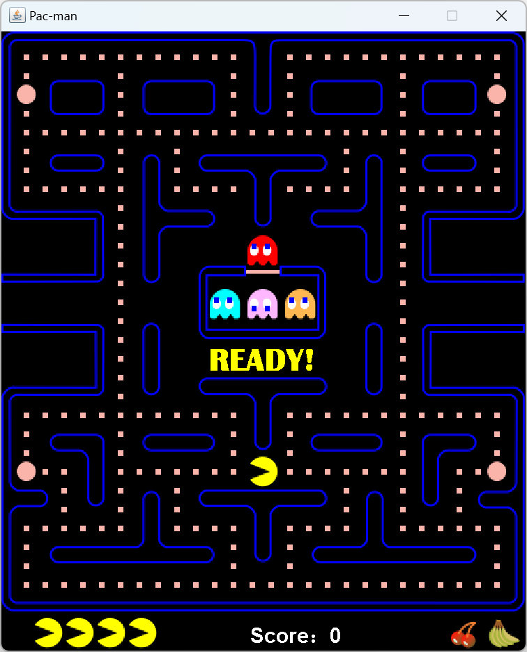

# Java PacMan

<h2> ● Introduction to Game Development </h2>

Player controls PacMan to shuttle through the maze, with the goal of collecting all the food and cherries while avoiding the pursuit of ghosts. Players can guide PacMan's movements through the arrow keys on the keyboard (↑↓←→). Ghosts will move randomly or strategically in the maze and may collide with walls. PacMan can collect food from the maze, as well as cherries and bananas, to increase the score. In addition, there are also powerpills scattered in the maze. When the Pac Man eats the powerpill, the ghosts will become fragile for the next 10 seconds, giving the PacMan a chance to eat ghosts. PacMan has four lives in total, and once all of them are lost, the game will end.

<h2> ● Characters of Game </h2>

 <em>Pacman</em>:  Pill eater. Controlled by players in the maze, move while eating pills.

 <em>Blinky</em>:  Red Ghost. Chasing bean eaters, also known as invaders.

 <em>Pinky</em>: Pink Ghost. Move at high speed in the maze to stay ahead of the player.

 <em>Inky</em>: Blue ghost. Use strategies to surround players before approaching them.

 <em>Clyde</em>: Orange Ghost. Switch between chasing players and escaping players.

<h2> ● Reference </h2>

 [1] Online PacMan Games <a href = "https://www.pacman1.net/" title = "www.pacman1.net"> https://www.pacman1.net/ </a>

 [2] P. Rohlfshagen, J. Liu, D. Perez-Liebana and S. M. Lucas, "Pac-Man Conquers Academia: Two Decades of Research Using a Classic Arcade Game," <em> IEEE Transactions on Games, </em> vol. 10, no. 3, pp. 233-256, Sept. 2018, doi: <a href="https://ieeexplore.ieee.org/document/8207594" title="Pac-Man Conquers Academia: Two Decades of Research Using a Classic Arcade Game">10.1109/TG.2017.2737145 </a>.

